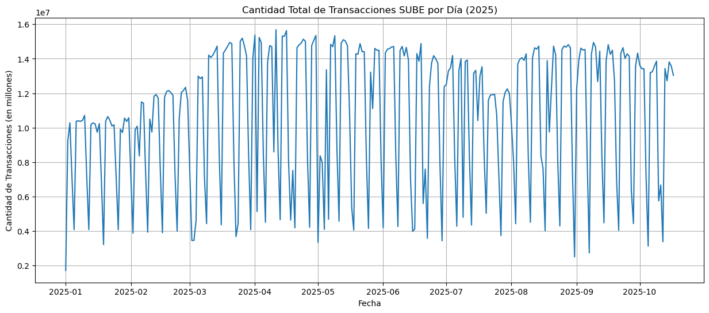

# Informe de Análisis Exploratorio de Datos (EDA)

Este informe presenta las conclusiones clave derivadas del análisis exploratorio de datos (EDA), como se solicita en la Entrega 3.

### 1. Agregación de Datos
El primer paso del preprocesamiento fue cargar el dataset original (`dat-ab-usos-2025.csv`) usando `pandas`. El dataset original de 424,347 filas se agregó por `DIA_TRANSPORTE` para crear una serie temporal de 290 días, donde la variable objetivo es la suma de `CANTIDAD`.

### 2. Análisis de la Serie Temporal
Se utilizó `matplotlib` (**Clase 3**) para graficar la serie temporal completa.

**Conclusiones Clave del Gráfico:**
* **Estacionalidad Semanal:** El gráfico mostró un patrón repetitivo muy claro de picos (días de semana) y valles (fines de semana).
* **Hipótesis de Feriados:** Se identificaron valles atípicos y mucho más profundos que los fines de semana (ej. 2025-01-01). Esto generó la hipótesis de que los feriados tenían un impacto significativo que debía ser modelado.

### 3. Validación de la Característica "Feriado"
Para validar la hipótesis, se creó la característica `es_feriado` (un 1 si el día estaba en la lista de feriados, 0 si no). Se generó un boxplot para comparar las distribuciones.

.png>)
``

**Conclusión de la Validación:**
El boxplot confirma la hipótesis de manera concluyente. La media de transacciones en "Día Normal (0)" es drásticamente más alta que la media en "Feriado (1)". Esto justifica la inclusión de `es_feriado` como una característica clave para el modelo.